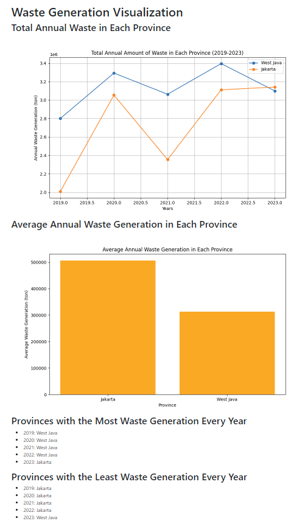

# Assigntment 9B: Waste Generation Analysis and Visualization by Group 4

## List of Members

1. Repan Dhia Nararya (Group Leader)
2. Dani Ardani
3. Nur Fauzuna Hannan Binti Ahmad
4. Rifa Sania
5. Rifanny Lysara Annastasya
6. Themy Sabri Syuhada

## Program Description

This project aims to analyze and visualize the annual waste generation data for different provinces in Indonesia. The application is built using Flask and provides a graphical representation of waste data, including total waste generation for each year and average annual waste generation for each province. Additionally, it identifies the province with the highest and lowest waste generation each year.

## Screenshot

